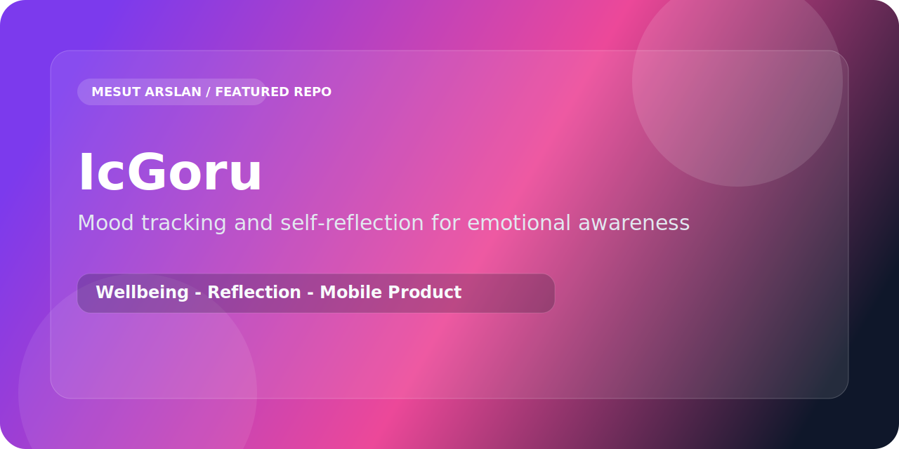

<p align="center">
  
</p>

<p align="center">
  
  
  
</p>

# IcGoru

`IcGoru` is a mobile self-reflection product designed to help users notice mood patterns, reflect more intentionally, and build a steadier emotional awareness habit.

## What It Delivers

- Mood tracking through a mobile-first flow
- Personal reflection oriented interaction design
- Lightweight habit support for recurring self check-ins
- A calmer product direction than generic productivity apps

## Stack

- React Native
- Expo
- JavaScript
- React Navigation

## Product Direction

The app is built around a simple idea: self-awareness becomes more useful when it is easy to revisit, visual enough to notice patterns, and gentle enough to keep using.

## Run Locally

```bash
npm install
npx expo start
```
